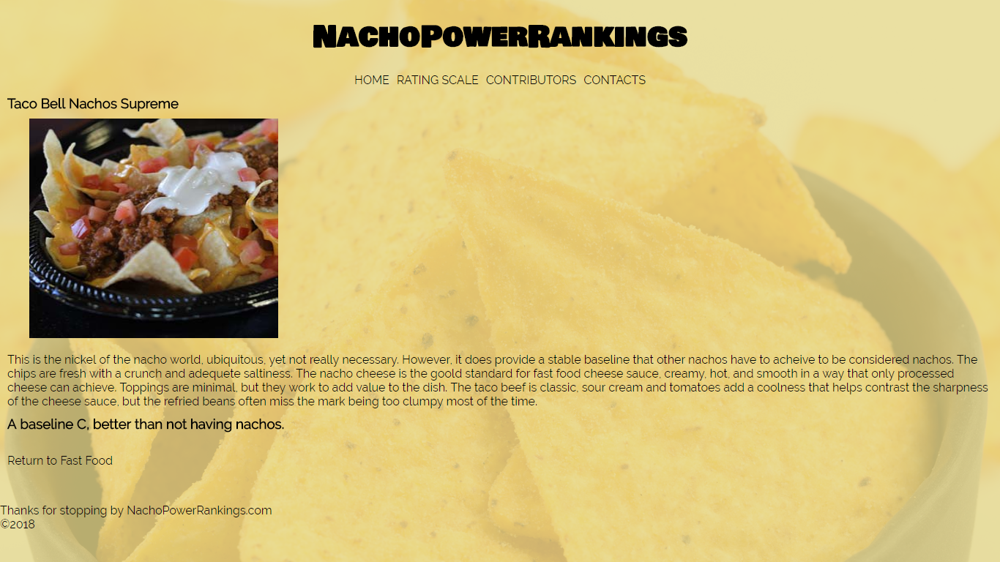

# Reviews Site, Full Stack ver 2.0
## Overview
In the week 9 capstone project we return to our full stack nachos review site.  In this iteration we take our week 7 project and add tags to the site.  We also add html form and the ability for user interaction with our site.
! [Screenshot of a review view](screenshotver2.png)
## Tasks
- [ ] Add tags to the reviews
	- [x] Create a ContentTag class.
		- [x] Create a Many to Many relationship with the Review class.
		- [x] Name element.
	- [ ] Clicking on a tag will display reviews assoicated with the tag.
	- [ ] Use HTML elements and AJAX to allow the user to add and remove tags from reviews.
	- [ ] Do not allow duplicate tags to be created.
- [ ] Add comments to reviews.  
	- [x] Create a Comment class.
		- [x] Create a Many to One relationship with the Review class.
		- [x] Commenter name, time and date, and content elements.   
	- [ ] Should be listed on the review page after review content.
	- [ ] Create a form on the review page that adds a comment to a review.
	- [ ] Use a HTML form submission.
	- [ ] After submitting comment refresh review page with user comment added.

## Team
Contributers:
	Rochelle Taylor
	Ben Williams
	
# Reviews Site, Full Stack
## Overview
In the week 7 capstone project I get to return the topic of nacho reviews. This time we are wiring up a full stack web app to serve the reviews.  The reviews are going to be stored in a H2 database.

## Tasks
- [x] Add the following dependencies to build.gradle (or use Spring Initializr to create a new build.gradle)
	- [x] JPA (spring-boot-starter-data-jpa)
	- [x] H2
- [x] Create a Category class that:
	- [x] is a JPA entity.
	- [x] contains an instance variable referencing the Reviews it contains.
 	- [x] configures an appropriate JPA relationship to its reviews.
- [x] Update the Review class such that:
	- [x] it is a JPA entity.
	- [x] configures a JPA relationship to its associated category.
	- [x] allows for a description/content/body longer than 255 characters.
- [x] Update your view (templates/html/css) such that:
	- [x] there is a page that lists review categories, each of which links to the (details) page for a specific category.
	- [x] there is a page that lists the reviews for a chosen category, each of which links to the (details) page for a specific review.
	- [x] each review detail page has a link to the page for its category.